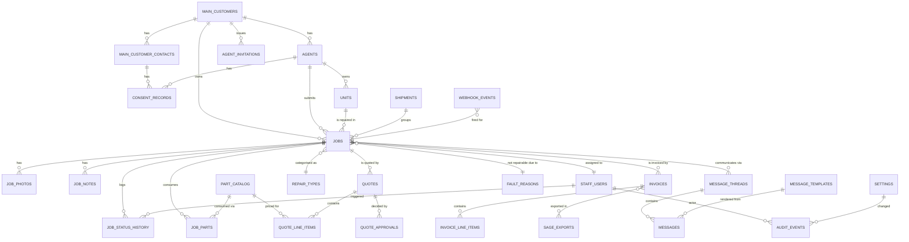

# Gentick RMS — Database Schema Design

**Version:** 1.0
**Date:** 31 May 2026
**Based on:** Requirements v1.0
**Status:** Phase 2 deliverable — ready for implementation

---

## 1. Overview

This document is the canonical reference for the Gentick RMS database. It covers:

- The conventions every table follows (UUIDs, timestamps, money, soft-delete, snapshots).
- The full entity catalogue with every column, type, and constraint.
- An entity-relationship diagram (Mermaid source — renders inline in GitHub, GitLab, VS Code, and the Mermaid Live Editor).
- Indexing strategy.
- POPIA and SARS retention design.
- The migration / versioning approach.

The companion file `001_initial_schema.sql` is the runnable PostgreSQL DDL derived from this document. They must be kept in sync — when this doc changes, generate a new migration; don't hand-edit prior migrations.

## 2. Cross-Cutting Conventions

These conventions apply to every table unless explicitly noted.

### 2.1 Primary keys

- **UUID** (`uuid` type) for all primary keys. Generated via `gen_random_uuid()` (requires the `pgcrypto` extension).
- Column always named `id`.
- Foreign keys named `{table_singular}_id` (e.g., `main_customer_id`, `job_id`).

### 2.2 Timestamps

- All time fields use `TIMESTAMPTZ` and are stored in UTC.
- Every user-mutable table has `created_at TIMESTAMPTZ NOT NULL DEFAULT now()` and `updated_at TIMESTAMPTZ NOT NULL DEFAULT now()`.
- `updated_at` is maintained by a trigger (`trg_set_updated_at`) — see DDL.

### 2.3 Money and currency

- Money columns use `NUMERIC(12,2)`. (Range covers up to ~10 billion, which is comfortably beyond any single-repair scenario.)
- Every money column is paired with a `currency_code CHAR(3)` column (ISO 4217). MVP uses `ZAR` and `USD` only; the supported list is enforced at the application layer (driven by the `settings` table), not by a DB enum, so adding a currency later is data-only.
- No FX conversion in the DB. Reports show currencies side-by-side.

### 2.4 Phone numbers

- Stored as E.164 strings (`VARCHAR(20)`), e.g., `+27821234567`. Validation enforced at the application layer.
- This is required for WhatsApp / Meta Cloud API interoperability.

### 2.5 Soft delete

- User-deletable entities (main_customers, agents, jobs, parts_catalog, etc.) carry `deleted_at TIMESTAMPTZ NULL`.
- All read paths filter `WHERE deleted_at IS NULL` by default. A small set of admin/audit screens may bypass this filter.
- A partial unique index pattern is used so unique constraints (like `customer_prefix`) only apply to live rows: `CREATE UNIQUE INDEX ... WHERE deleted_at IS NULL`.

### 2.6 POPIA scrubbing vs SARS retention

- On a POPIA right-to-erasure request: the relevant row's `deleted_at` is set AND its PII columns (name, email, phone, address) are overwritten with placeholder values (e.g., `[REDACTED]`). The transaction shell (amounts, dates, job stages) is retained for SARS.
- A scheduled job hard-deletes rows whose `deleted_at` is older than the retention window: 7 years for jobs/quotes/invoices/audit; 2 years for job photos. Implemented as a Postgres `DELETE` script run by n8n on a monthly cadence.

### 2.7 Immutable snapshots

- `quotes` and `invoices` carry snapshot columns (`*_snapshot JSONB`) containing the customer details, Gentick company details, and other values at the moment of issue.
- Once a quote or invoice is `issued`, the snapshot is never updated. Re-rendering the PDF reads the snapshot, not the live records.
- The snapshot strategy chosen is JSONB (over per-column duplication) for flexibility — different document types snapshot different shapes.

### 2.8 Audit log

- Every mutation to a sensitive entity (customers, agents, consent, settings, quotes, invoices, role changes, deletions) writes a row to `audit_events`.
- `audit_events.before_value` and `after_value` are JSONB diffs; the application is responsible for populating these.

### 2.9 Enums

- We use Postgres native `ENUM` types for short, stable lists where the value space is well-known (job stages, invoice types, etc.).
- For lists that grow over time (repair types, fault reasons), use lookup tables instead.

### 2.10 Auth integration

- Supabase Auth users live in `auth.users` (a separate schema managed by Supabase). We do NOT create a DB-level foreign key into it.
- `staff_users`, `main_customer_contacts`, and `agents` each carry a nullable `supabase_user_id UUID` referencing `auth.users.id`. Linked at signup / invite acceptance.

## 3. ERD (Mermaid)

Paste this into the [Mermaid Live Editor](https://mermaid.live) to view or modify, or open this file in any tool that renders Mermaid (GitHub, VS Code).



## 4. Entity Catalogue

Grouped by domain area. Every entity below has `created_at`, `updated_at`, and (where noted) `deleted_at`, in addition to the columns shown.

### 4.1 Customers and Agents

#### `main_customers`
The corporation that intermediates between Gentick and the agents.

| Column | Type | Notes |
| --- | --- | --- |
| `id` | `UUID` PK | `gen_random_uuid()` |
| `customer_prefix` | `VARCHAR(10)` | Uppercase, used in job numbers (e.g., `ACME`). Unique among live rows. |
| `corporation_name` | `VARCHAR(255)` | Required |
| `notes` | `TEXT` | Optional |
| `deleted_at` | `TIMESTAMPTZ` | Nullable |

Indexes: `UNIQUE (lower(customer_prefix)) WHERE deleted_at IS NULL`.

#### `main_customer_contacts`
A person at the main customer corporation. Multiple per main customer supported (one will be primary).

| Column | Type | Notes |
| --- | --- | --- |
| `id` | `UUID` PK | |
| `main_customer_id` | `UUID` FK | → `main_customers.id` |
| `contact_person` | `VARCHAR(255)` | |
| `contact_email` | `VARCHAR(255)` | |
| `contact_phone` | `VARCHAR(20)` | E.164 |
| `is_primary` | `BOOLEAN DEFAULT FALSE` | Exactly one primary per main_customer (enforced at app layer) |
| `supabase_user_id` | `UUID` | Nullable until invite accepted |
| `deleted_at` | `TIMESTAMPTZ` | |

Indexes: `(main_customer_id)`, `UNIQUE (supabase_user_id) WHERE supabase_user_id IS NOT NULL`.

#### `agents`
A downstream customer of the main customer. Has login credentials and can initiate repairs.

| Column | Type | Notes |
| --- | --- | --- |
| `id` | `UUID` PK | |
| `main_customer_id` | `UUID` FK | → `main_customers.id` |
| `agent_name` | `VARCHAR(255)` | |
| `agent_email` | `VARCHAR(255)` | |
| `agent_phone` | `VARCHAR(20)` | E.164 |
| `address_line1` | `VARCHAR(255)` | |
| `address_line2` | `VARCHAR(255)` | nullable |
| `city` | `VARCHAR(100)` | |
| `province` | `VARCHAR(100)` | |
| `postal_code` | `VARCHAR(20)` | |
| `country` | `VARCHAR(100) DEFAULT 'South Africa'` | |
| `supabase_user_id` | `UUID` | Nullable until invite accepted |
| `invited_at` | `TIMESTAMPTZ` | |
| `invitation_accepted_at` | `TIMESTAMPTZ` | |
| `deleted_at` | `TIMESTAMPTZ` | |

Indexes: `(main_customer_id)`, `UNIQUE (supabase_user_id) WHERE supabase_user_id IS NOT NULL`, `(lower(agent_email)) WHERE deleted_at IS NULL`.

#### `agent_invitations`
Pending invites issued by a main customer.

| Column | Type | Notes |
| --- | --- | --- |
| `id` | `UUID` PK | |
| `main_customer_id` | `UUID` FK | |
| `agent_name` | `VARCHAR(255)` | |
| `agent_email` | `VARCHAR(255)` | |
| `token` | `VARCHAR(64)` | Random URL-safe token. Unique. |
| `expires_at` | `TIMESTAMPTZ` | Typically 14 days |
| `accepted_at` | `TIMESTAMPTZ` | Nullable; populated on acceptance |
| `accepted_agent_id` | `UUID` | Nullable; FK → agents.id when accepted |

Indexes: `UNIQUE (token)`, `(main_customer_id)`, `(expires_at) WHERE accepted_at IS NULL`.

#### `consent_records`
POPIA opt-in event log. One row per consent event (grant or revoke). Latest row per subject + channel = current state.

| Column | Type | Notes |
| --- | --- | --- |
| `id` | `UUID` PK | |
| `subject_type` | `subject_type_enum` | `main_customer_contact` or `agent` |
| `subject_id` | `UUID` | Polymorphic — points to either table |
| `channel` | `consent_channel_enum` | `whatsapp` or `email` |
| `action` | `consent_action_enum` | `granted` or `revoked` |
| `wording_version` | `VARCHAR(20)` | Which consent text was shown |
| `recorded_at` | `TIMESTAMPTZ` | |
| `recorded_via` | `VARCHAR(50)` | `web_form`, `staff_admin`, `imported` |
| `ip_address` | `INET` | Nullable |
| `user_agent` | `TEXT` | Nullable |

Indexes: `(subject_type, subject_id, channel, recorded_at DESC)` for fast "current consent" lookups.

### 4.2 Units and Shipments

#### `units`
A persistent physical unit (telemetry unit or sensor). Tracked by serial number across repair jobs.

| Column | Type | Notes |
| --- | --- | --- |
| `id` | `UUID` PK | |
| `serial_number` | `VARCHAR(64)` | Unique among live rows |
| `unit_type` | `VARCHAR(100)` | e.g., "Telemetry Unit Model X", "Soil Probe v2" |
| `current_agent_id` | `UUID` FK | nullable; updated when ownership transfers |
| `first_seen_at` | `TIMESTAMPTZ` | first time it appeared in a job |
| `last_seen_at` | `TIMESTAMPTZ` | most recent job |
| `total_repair_count` | `INTEGER DEFAULT 0` | Denormalised counter, updated by trigger |
| `notes` | `TEXT` | |
| `deleted_at` | `TIMESTAMPTZ` | |

Indexes: `UNIQUE (lower(serial_number)) WHERE deleted_at IS NULL`, `(current_agent_id)`.

#### `shipments`
A physical batch of units received in a single delivery, possibly containing multiple jobs.

| Column | Type | Notes |
| --- | --- | --- |
| `id` | `UUID` PK | |
| `origin` | `shipment_origin_enum` | `main_customer`, `agent`, `walk_in` |
| `originator_main_customer_id` | `UUID` FK | nullable |
| `originator_agent_id` | `UUID` FK | nullable |
| `tracking_number` | `VARCHAR(100)` | Courier tracking, nullable |
| `received_at` | `TIMESTAMPTZ` | |
| `received_by_staff_id` | `UUID` FK | → `staff_users.id` |
| `notes` | `TEXT` | |

Constraint: at least one of `originator_main_customer_id` or `originator_agent_id` must be NOT NULL unless `origin = 'walk_in'`.

Indexes: `(received_at DESC)`, `(originator_main_customer_id)`, `(originator_agent_id)`.

### 4.3 Jobs

#### `jobs`
A single repair task for a single unit. The central entity.

| Column | Type | Notes |
| --- | --- | --- |
| `id` | `UUID` PK | |
| `job_number` | `VARCHAR(30)` | `GT-{PREFIX}-NNNN`. Unique. |
| `main_customer_id` | `UUID` FK | |
| `agent_id` | `UUID` FK | |
| `unit_id` | `UUID` FK | → `units.id` |
| `shipment_id` | `UUID` FK | nullable for jobs created before receipt |
| `repair_type_id` | `UUID` FK | → `repair_types.id` |
| `current_stage` | `job_stage_enum` | Denormalised for fast queries; source of truth is `job_status_history` |
| `current_stage_changed_at` | `TIMESTAMPTZ` | |
| `assigned_technician_id` | `UUID` FK | → `staff_users.id`, nullable |
| `originator_type` | `originator_type_enum` | `main_customer`, `agent`, `front_desk` |
| `originator_id` | `UUID` | Polymorphic FK by `originator_type` |
| `fault_description` | `TEXT` | |
| `accessories` | `TEXT` | What came in with the unit |
| `not_repairable_reason_id` | `UUID` FK | → `fault_reasons.id`, nullable |
| `not_repairable_reason_other` | `TEXT` | Free text when reason = "other" |
| `assessment_fee_amount` | `NUMERIC(12,2)` | nullable; populated when Not Repairable |
| `assessment_fee_currency` | `CHAR(3)` | nullable |
| `assessment_fee_waived` | `BOOLEAN DEFAULT FALSE` | |
| `assessment_fee_waiver_reason` | `TEXT` | nullable |
| `intake_at` | `TIMESTAMPTZ` | |
| `closed_at` | `TIMESTAMPTZ` | nullable until terminal stage |
| `deleted_at` | `TIMESTAMPTZ` | |

Indexes: `UNIQUE (job_number)`, `(main_customer_id, current_stage)`, `(agent_id, current_stage)`, `(assigned_technician_id, current_stage)`, `(current_stage, current_stage_changed_at)`, `(intake_at DESC)`, partial index for active jobs `(current_stage) WHERE deleted_at IS NULL AND closed_at IS NULL`.

#### `job_status_history`
Full audit log of every stage transition.

| Column | Type | Notes |
| --- | --- | --- |
| `id` | `UUID` PK | |
| `job_id` | `UUID` FK | |
| `from_stage` | `job_stage_enum` | nullable (first transition) |
| `to_stage` | `job_stage_enum` | |
| `transition_at` | `TIMESTAMPTZ DEFAULT now()` | |
| `transitioned_by_user_id` | `UUID` | nullable (system-triggered) |
| `transitioned_by_actor_type` | `actor_type_enum` | `staff`, `main_customer`, `agent`, `system` |
| `notes` | `TEXT` | |

Indexes: `(job_id, transition_at DESC)`.

#### `job_photos`
Photos attached to a job. Files stored on disk under `/uploads/jobs/{job_id}/` per requirements.

| Column | Type | Notes |
| --- | --- | --- |
| `id` | `UUID` PK | |
| `job_id` | `UUID` FK | |
| `file_path` | `VARCHAR(500)` | Relative to upload root |
| `original_filename` | `VARCHAR(255)` | |
| `mime_type` | `VARCHAR(100)` | |
| `file_size_bytes` | `BIGINT` | |
| `caption` | `TEXT` | nullable |
| `visibility` | `photo_visibility_enum` | `internal` or `customer` |
| `uploaded_by_user_id` | `UUID` | |
| `uploaded_at` | `TIMESTAMPTZ DEFAULT now()` | |
| `deleted_at` | `TIMESTAMPTZ` | |

Indexes: `(job_id)`, `(uploaded_at DESC)`.

#### `job_notes`
Free-text notes per job, with visibility flag.

| Column | Type | Notes |
| --- | --- | --- |
| `id` | `UUID` PK | |
| `job_id` | `UUID` FK | |
| `author_user_id` | `UUID` | |
| `author_actor_type` | `actor_type_enum` | |
| `body` | `TEXT` | |
| `visibility` | `note_visibility_enum` | `internal` or `customer` |

Indexes: `(job_id, created_at DESC)`.

### 4.4 Parts

#### `parts_catalog`
Admin-maintained master list of parts.

| Column | Type | Notes |
| --- | --- | --- |
| `id` | `UUID` PK | |
| `code` | `VARCHAR(50)` | Unique among live rows |
| `description` | `TEXT` | |
| `unit_cost` | `NUMERIC(12,2)` | Current cost |
| `currency_code` | `CHAR(3) DEFAULT 'ZAR'` | |
| `active` | `BOOLEAN DEFAULT TRUE` | |
| `deleted_at` | `TIMESTAMPTZ` | |

Indexes: `UNIQUE (lower(code)) WHERE deleted_at IS NULL`.

#### `job_parts`
Parts consumed per job. **Snapshots the cost at time of consumption** so historical reports remain accurate when catalogue prices change.

| Column | Type | Notes |
| --- | --- | --- |
| `id` | `UUID` PK | |
| `job_id` | `UUID` FK | |
| `part_id` | `UUID` FK | → `parts_catalog.id` |
| `quantity` | `NUMERIC(10,3)` | Decimals allowed for weight/length units |
| `unit_cost_at_use` | `NUMERIC(12,2)` | Snapshot |
| `currency_code` | `CHAR(3)` | Snapshot |
| `recorded_by_user_id` | `UUID` | |
| `recorded_at` | `TIMESTAMPTZ DEFAULT now()` | |

Indexes: `(job_id)`, `(part_id, recorded_at DESC)` for parts-usage reports.

### 4.5 Quotes and Invoices

#### `quotes`
A repair quote with full immutable snapshot.

| Column | Type | Notes |
| --- | --- | --- |
| `id` | `UUID` PK | |
| `job_id` | `UUID` FK | |
| `quote_number` | `VARCHAR(30)` | `Q-{JOB_NUMBER}-{version}`, e.g., `Q-GT-ACME-0001-1` |
| `version` | `INTEGER DEFAULT 1` | Incremented on re-quote |
| `currency_code` | `CHAR(3)` | Snapshot |
| `subtotal` | `NUMERIC(12,2)` | |
| `vat_rate` | `NUMERIC(5,2)` | e.g., 15.00 or 0.00 |
| `vat_amount` | `NUMERIC(12,2)` | |
| `total` | `NUMERIC(12,2)` | |
| `validity_days` | `INTEGER DEFAULT 14` | |
| `issued_at` | `TIMESTAMPTZ` | |
| `expires_at` | `TIMESTAMPTZ` | |
| `status` | `quote_status_enum` | `draft`, `issued`, `approved`, `rejected`, `expired`, `superseded` |
| `approval_authority` | `approval_authority_enum DEFAULT 'main_customer'` | Phase 2 hook: `main_customer` or `agent_threshold` |
| `customer_snapshot` | `JSONB` | Main customer + contact details at issue |
| `agent_snapshot` | `JSONB` | Agent details at issue |
| `unit_snapshot` | `JSONB` | Unit details at issue |
| `gentick_snapshot` | `JSONB` | Gentick legal name, address, VAT number |
| `notes` | `TEXT` | |
| `deleted_at` | `TIMESTAMPTZ` | |

Constraint: `total = subtotal + vat_amount` (CHECK).
Indexes: `UNIQUE (quote_number)`, `(job_id, version)`, `(status, expires_at)`.

#### `quote_line_items`
Individual line items on a quote.

| Column | Type | Notes |
| --- | --- | --- |
| `id` | `UUID` PK | |
| `quote_id` | `UUID` FK | |
| `line_number` | `INTEGER` | For display ordering |
| `description` | `TEXT` | |
| `is_labour` | `BOOLEAN` | Distinguishes labour from parts for reporting |
| `part_id` | `UUID` FK | nullable; links to `parts_catalog.id` if a part |
| `quantity` | `NUMERIC(10,3)` | |
| `unit_price` | `NUMERIC(12,2)` | |
| `line_total` | `NUMERIC(12,2)` | |

Indexes: `(quote_id, line_number)`.

#### `quote_approvals`
Records the approval or rejection event.

| Column | Type | Notes |
| --- | --- | --- |
| `id` | `UUID` PK | |
| `quote_id` | `UUID` FK | |
| `decision` | `quote_decision_enum` | `approved`, `rejected` |
| `decided_by_user_id` | `UUID` | |
| `decided_by_actor_type` | `actor_type_enum` | |
| `decided_at` | `TIMESTAMPTZ DEFAULT now()` | |
| `channel` | `decision_channel_enum` | `whatsapp`, `email`, `portal` |
| `source_message_id` | `UUID` FK | nullable; if approved via WhatsApp |
| `notes` | `TEXT` | |

Indexes: `(quote_id, decided_at DESC)`.

#### `invoices` (proforma)
Proforma invoices generated on job closure or assessment-fee triggers.

| Column | Type | Notes |
| --- | --- | --- |
| `id` | `UUID` PK | |
| `job_id` | `UUID` FK | |
| `invoice_number` | `VARCHAR(30)` | `INV-{JOB_NUMBER}-{seq}` |
| `type` | `invoice_type_enum` | `repair`, `assessment_fee` |
| `currency_code` | `CHAR(3)` | Snapshot |
| `subtotal` | `NUMERIC(12,2)` | |
| `vat_rate` | `NUMERIC(5,2)` | |
| `vat_amount` | `NUMERIC(12,2)` | |
| `total` | `NUMERIC(12,2)` | |
| `issued_at` | `TIMESTAMPTZ` | |
| `status` | `invoice_status_enum` | `issued`, `exported_to_sage` |
| `sage_export_id` | `UUID` FK | nullable; → `sage_exports.id` |
| `customer_snapshot` | `JSONB` | |
| `agent_snapshot` | `JSONB` | |
| `gentick_snapshot` | `JSONB` | |
| `notes` | `TEXT` | |

Constraint: `total = subtotal + vat_amount` (CHECK).
Indexes: `UNIQUE (invoice_number)`, `(job_id)`, `(issued_at DESC)`, `(status) WHERE status = 'issued'`.

#### `invoice_line_items`
Lines on an invoice.

Schema mirrors `quote_line_items` minus the part FK distinction.

#### `sage_exports`
A batch of invoices exported as CSV/XML for Sage Pastel Online.

| Column | Type | Notes |
| --- | --- | --- |
| `id` | `UUID` PK | |
| `format` | `sage_format_enum` | `csv`, `xml` |
| `filename` | `VARCHAR(255)` | |
| `file_path` | `VARCHAR(500)` | |
| `generated_at` | `TIMESTAMPTZ` | |
| `generated_by_user_id` | `UUID` | |
| `invoice_count` | `INTEGER` | |
| `downloaded_at` | `TIMESTAMPTZ` | nullable |

### 4.6 Messaging

#### `message_threads`
A conversation thread per job per party (main customer or agent) per channel.

| Column | Type | Notes |
| --- | --- | --- |
| `id` | `UUID` PK | |
| `job_id` | `UUID` FK | |
| `party_type` | `party_type_enum` | `main_customer`, `agent` |
| `party_id` | `UUID` | Polymorphic |
| `channel` | `comm_channel_enum` | `whatsapp`, `email` |
| `opened_at` | `TIMESTAMPTZ DEFAULT now()` | |
| `closed_at` | `TIMESTAMPTZ` | nullable |

Indexes: `(job_id, party_type, party_id, channel)`, `(channel, opened_at DESC)`.

#### `messages`
Individual messages (inbound and outbound).

| Column | Type | Notes |
| --- | --- | --- |
| `id` | `UUID` PK | |
| `thread_id` | `UUID` FK | |
| `direction` | `message_direction_enum` | `inbound`, `outbound` |
| `channel` | `comm_channel_enum` | |
| `external_id` | `VARCHAR(255)` | WhatsApp message ID or email message-id |
| `template_id` | `UUID` FK | nullable; → `message_templates.id` if outbound from a template |
| `classified_intent` | `message_intent_enum` | `approval_yes`, `approval_no`, `question`, `other`, nullable |
| `body` | `TEXT` | |
| `sent_at` | `TIMESTAMPTZ` | |
| `delivered_at` | `TIMESTAMPTZ` | nullable |
| `read_at` | `TIMESTAMPTZ` | nullable |
| `error` | `TEXT` | nullable |

Indexes: `(thread_id, sent_at DESC)`, `(channel, sent_at DESC)`, `(classified_intent) WHERE classified_intent IS NOT NULL`, `UNIQUE (external_id) WHERE external_id IS NOT NULL`.

#### `message_templates`
Versioned message templates.

| Column | Type | Notes |
| --- | --- | --- |
| `id` | `UUID` PK | |
| `name` | `VARCHAR(100)` | e.g., `job_received`, `quote_ready`, `ready_for_collection` |
| `channel` | `comm_channel_enum` | |
| `language` | `VARCHAR(10) DEFAULT 'en'` | |
| `body` | `TEXT` | Template with placeholders, e.g., `{{job_number}}` |
| `version` | `INTEGER DEFAULT 1` | |
| `retired_at` | `TIMESTAMPTZ` | nullable; templates are never deleted, only retired |

Indexes: `(name, channel, version DESC)`, partial for current `WHERE retired_at IS NULL`.

### 4.7 Reference Data

#### `staff_users`
Gentick internal users.

| Column | Type | Notes |
| --- | --- | --- |
| `id` | `UUID` PK | |
| `supabase_user_id` | `UUID` | Unique among live rows |
| `full_name` | `VARCHAR(255)` | |
| `email` | `VARCHAR(255)` | |
| `role` | `staff_role_enum` | `admin`, `technician`, `front_desk` |
| `active` | `BOOLEAN DEFAULT TRUE` | |
| `deactivated_at` | `TIMESTAMPTZ` | nullable |

Indexes: `UNIQUE (supabase_user_id)`, `(role) WHERE active = TRUE`.

#### `repair_types`
Admin-maintained taxonomy.

| Column | Type | Notes |
| --- | --- | --- |
| `id` | `UUID` PK | |
| `code` | `VARCHAR(50)` | Unique |
| `name` | `VARCHAR(255)` | |
| `parent_id` | `UUID` FK | nullable; for future hierarchy |
| `active` | `BOOLEAN DEFAULT TRUE` | |

#### `fault_reasons`
Structured reasons for Not Repairable.

| Column | Type | Notes |
| --- | --- | --- |
| `id` | `UUID` PK | |
| `code` | `VARCHAR(50)` | e.g., `lightning`, `water_damage` |
| `label` | `VARCHAR(255)` | e.g., "Lightning damage" |
| `active` | `BOOLEAN DEFAULT TRUE` | |

Seeded with: `lightning`, `secondary_lightning`, `water_damage`, `component_failure`, `power_supply_failure`, `chip_probe_communication`, `other`.

### 4.8 System

#### `settings`
Key-value system settings with full version history.

| Column | Type | Notes |
| --- | --- | --- |
| `id` | `UUID` PK | |
| `key` | `VARCHAR(100)` | e.g., `company_details`, `assessment_fee_zar`, `escalation_contact`, `email_from_address`, `quote_validity_days` |
| `value` | `JSONB` | Shape varies by key |
| `version` | `INTEGER` | Incremented per key |
| `valid_from` | `TIMESTAMPTZ` | |
| `valid_to` | `TIMESTAMPTZ` | NULL = current |
| `changed_by_user_id` | `UUID` | |
| `change_reason` | `TEXT` | nullable |

Indexes: `UNIQUE (key, version)`, `(key) WHERE valid_to IS NULL` for fast "current value" reads.

#### `audit_events`
Append-only audit log.

| Column | Type | Notes |
| --- | --- | --- |
| `id` | `UUID` PK | |
| `actor_user_id` | `UUID` | nullable for system events |
| `actor_type` | `actor_type_enum` | |
| `event_type` | `VARCHAR(100)` | e.g., `customer.created`, `quote.approved`, `setting.changed` |
| `entity_type` | `VARCHAR(50)` | |
| `entity_id` | `UUID` | |
| `before_value` | `JSONB` | nullable |
| `after_value` | `JSONB` | nullable |
| `ip_address` | `INET` | nullable |
| `user_agent` | `TEXT` | nullable |
| `occurred_at` | `TIMESTAMPTZ DEFAULT now()` | |

Indexes: `(entity_type, entity_id, occurred_at DESC)`, `(occurred_at DESC)`, `(event_type, occurred_at DESC)`.

#### `webhook_events`
Outbound webhook event log — what the RMS told n8n.

| Column | Type | Notes |
| --- | --- | --- |
| `id` | `UUID` PK | |
| `event_type` | `VARCHAR(100)` | e.g., `job.received`, `quote.ready`, `job.not_repairable` |
| `job_id` | `UUID` FK | nullable |
| `payload` | `JSONB` | |
| `emitted_at` | `TIMESTAMPTZ DEFAULT now()` | |
| `delivered_at` | `TIMESTAMPTZ` | nullable; populated when n8n ACKs |
| `delivery_attempts` | `INTEGER DEFAULT 0` | |
| `last_error` | `TEXT` | nullable |

Indexes: `(event_type, emitted_at DESC)`, `(job_id, emitted_at DESC)`, `(delivered_at) WHERE delivered_at IS NULL` for retry queue.

## 5. Enumerations

Native Postgres ENUM types. Adding values is a migration; removing values is a multi-step migration (deprecate in app, migrate data, then drop value).

| Enum | Values |
| --- | --- |
| `job_stage_enum` | received, diagnosed, quoted, approved, in_progress, qc, boxed, ready_for_collection, collected, closed, not_repairable, rejected, cancelled |
| `shipment_origin_enum` | main_customer, agent, walk_in |
| `originator_type_enum` | main_customer, agent, front_desk |
| `actor_type_enum` | staff, main_customer, agent, system |
| `subject_type_enum` | main_customer_contact, agent |
| `consent_channel_enum` | whatsapp, email |
| `consent_action_enum` | granted, revoked |
| `staff_role_enum` | admin, technician, front_desk |
| `photo_visibility_enum` | internal, customer |
| `note_visibility_enum` | internal, customer |
| `quote_status_enum` | draft, issued, approved, rejected, expired, superseded |
| `quote_decision_enum` | approved, rejected |
| `decision_channel_enum` | whatsapp, email, portal |
| `approval_authority_enum` | main_customer, agent_threshold |
| `invoice_type_enum` | repair, assessment_fee |
| `invoice_status_enum` | issued, exported_to_sage |
| `sage_format_enum` | csv, xml |
| `party_type_enum` | main_customer, agent |
| `comm_channel_enum` | whatsapp, email |
| `message_direction_enum` | inbound, outbound |
| `message_intent_enum` | approval_yes, approval_no, question, other |

## 6. Indexing Strategy

Two principles drive index choices:

1. **Match the dashboards.** Every report/dashboard query has a supporting index. The active jobs dashboard hits `jobs (current_stage, current_stage_changed_at)`; the turnaround report hits `jobs (intake_at, closed_at)` filtered on terminal stages; the technician workload hits `jobs (assigned_technician_id, current_stage)`.
2. **Keep deletes cheap.** Partial indexes filtered on `deleted_at IS NULL` so soft-deleted rows don't bloat lookup performance.

Critical indexes are listed in each entity table above. The DDL file enforces them.

For the messaging tables, expect high write volume during business hours. The `messages (thread_id, sent_at DESC)` index is the hot read path; consider a future BRIN index on `messages.sent_at` if the table grows beyond a few hundred thousand rows.

## 7. POPIA and SARS Retention Design

This deserves its own section because it's where regulation meets implementation.

**POPIA right to erasure flow:**

1. Customer submits a deletion request (in writing).
2. Admin runs the erasure script on the targeted contact or agent record.
3. The script:
   - Sets `deleted_at = now()` on the contact/agent.
   - Sets `deleted_at` on all child records that are user-deletable (consent records remain — they ARE the legal evidence of the deletion request).
   - Overwrites PII columns on the contact/agent (name, email, phone, address) with `[REDACTED]`.
   - Writes an `audit_events` row of type `customer.erased`.
4. Quotes, invoices, and job records remain, with their snapshot JSON preserved (legal/SARS requirement) — but the snapshot can have PII fields redacted as well; the configurable retention script handles this.

**SARS retention timeline:**

- `jobs`, `quotes`, `invoices`, `audit_events`, `consent_records`: 7 years post-closure.
- `job_photos`: 2 years post-closure unless required for ongoing dispute (flagged manually).
- `webhook_events`, `messages`: 7 years (treat as part of customer correspondence record).
- Settings versions: kept indefinitely (small volume, important for reproducing past behaviour).

**The hard-delete script** runs monthly via n8n. It identifies rows with `deleted_at < now() - retention_window` and `DELETE`s them. Foreign keys with `ON DELETE CASCADE` handle child rows; foreign keys to references (parts_catalog, repair_types) use `ON DELETE RESTRICT` to prevent accidental loss.

## 8. Versioning and Migrations

- Migrations live in `/db/migrations/` numbered sequentially: `001_initial_schema.sql`, `002_add_X.sql`, etc.
- Each migration is idempotent where reasonable (`CREATE TABLE IF NOT EXISTS`, `CREATE INDEX IF NOT EXISTS`) but schema changes that aren't naturally idempotent get a transaction wrapper with explicit rollback.
- Use a migration runner — recommended: [`node-pg-migrate`](https://github.com/salsita/node-pg-migrate) or [`Prisma Migrate`](https://www.prisma.io/migrate). Either fits the Next.js + TypeScript stack.
- The `_migrations` table tracks applied migrations. Don't edit applied migrations — create a new one.

## 9. Notes for the Build

A few non-obvious things developers should know:

1. **Polymorphic FKs** (`originator_id` on jobs, `subject_id` on consent_records, `party_id` on message_threads) aren't enforced at the DB level. Add a CHECK constraint pattern at the application layer or use a discriminator + view if strict enforcement matters.
2. **The `current_stage` denormalisation on `jobs`** must stay in sync with `job_status_history`. Implement via a `BEFORE UPDATE` trigger that writes a history row whenever `current_stage` changes — this guarantees consistency.
3. **Snapshot JSON shape** is owned by the application, not the DB. Document the shape in TypeScript types and validate on write with `zod` or similar.
4. **`pgcrypto` extension** is required for `gen_random_uuid()` — enabled in the DDL.
5. **Settings reads** should be cached in-app (e.g., Next.js `unstable_cache`) and invalidated on `setting.changed` events to avoid hammering the DB.
6. **Customer prefix uniqueness** is case-insensitive — the unique index uses `lower(customer_prefix)`. Always normalise to uppercase in the app.

## 10. What's Not in This Schema (yet)

These were considered and deferred to keep MVP focused:

- **Multi-warehouse / location tables** — Phase 2.
- **FX rate table** — Phase 2 (needed only if/when we add ZAR-normalised reporting).
- **Customer feedback / NPS tables** — Phase 2.
- **Knowledge base** — Phase 3.
- **Parts procurement / purchase orders** — Phase 3.

When these come in, they should follow the same conventions documented in Section 2.

---

## Appendix A: Sample Job Number Generation

```sql
-- Pseudocode: in practice this is done in app code with a sequence per prefix
SELECT
  'GT-' || mc.customer_prefix || '-' ||
  LPAD((COALESCE(MAX(job_seq_for_prefix(j.job_number)), 0) + 1)::text, 4, '0')
FROM main_customers mc
LEFT JOIN jobs j ON j.main_customer_id = mc.id
WHERE mc.id = $1
GROUP BY mc.customer_prefix;
```

Recommended app-side implementation: dedicated per-prefix sequence stored in the `settings` table or in a small `job_number_sequences` table, incremented with `SELECT ... FOR UPDATE` inside the same transaction that inserts the job.

## Appendix B: Companion Files

- `001_initial_schema.sql` — runnable PostgreSQL DDL.
- `Gentick_RMS_ERD_v1.0.png` — rendered visual ERD.
- `Gentick_RMS_ERD_v1.0.mmd` — standalone Mermaid source (mirrors Section 3).
